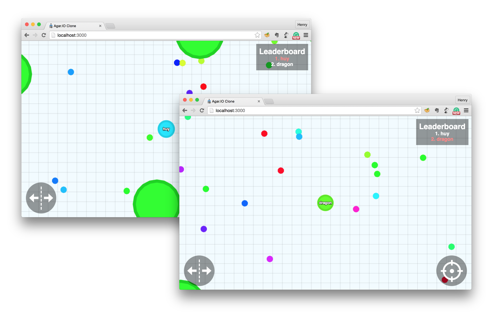

# agar.io-clone-master-application
A simple but powerful Agar.IO clone built with socket.IO and HTML5 canvas on top of NodeJS.    ## Live Demos An updated and live list of live demos can be found on the [Live Demos wiki page.
